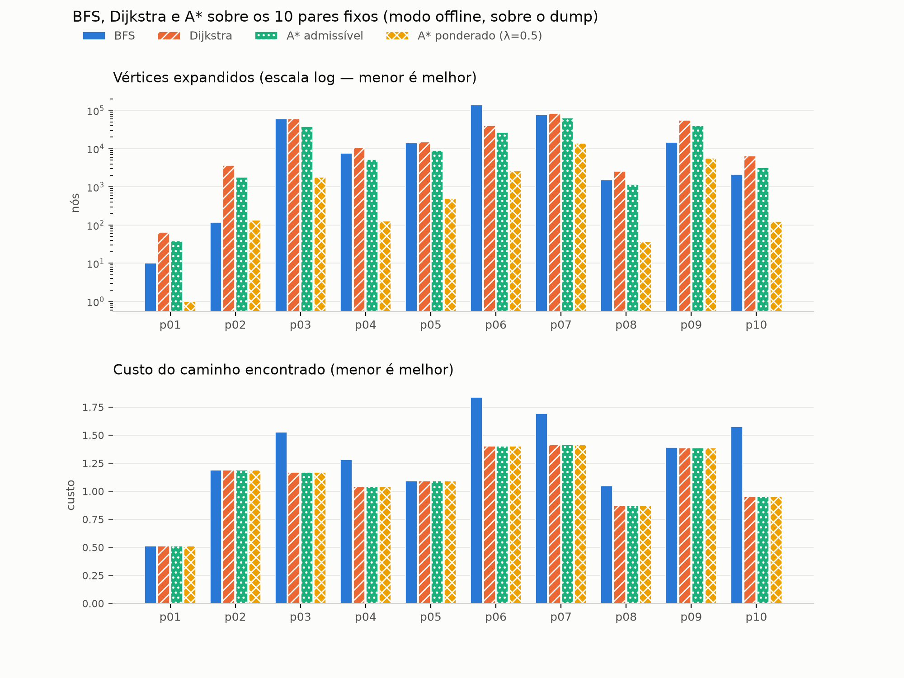

# G46_Grafos_PA-26.2

## Alunos

| Matrícula | Aluno |
|---|---|
| 222021826 | Victor Leandro Rocha de Assis |

## Sobre

Projeto em TypeScript (Next.js) que encontra o **melhor caminho entre dois artigos da
Wikipédia** navegando apenas por hiperlinks. O grafo é construído **sob demanda** a partir da
MediaWiki Action API: nenhuma estrutura global é carregada em memória, e a vizinhança de um
artigo só passa a existir depois que ele é expandido.

O programa resolve o mesmo par por quatro configurações — BFS, Dijkstra, A* com heurística
admissível e A* ponderado —, mede as quatro lado a lado e desenha o subgrafo explorado com o
caminho destacado. Um dump versionado permite rodar tudo sem rede.




## Modelagem do grafo

- **Vértices:** artigos do namespace 0, identificados pelo título canônico pós-redirect.
- **Arestas:** hiperlink `u → v` presente no corpo de `u`. **Direcionado** — o link não é
  simétrico.
- **Peso da aresta:** real positivo em `(0.1, 1.1]`, ver abaixo.
- **Topologia:** esparso, com fator de ramificação alto (dezenas a centenas de links por
  artigo), mundo pequeno e **cíclico**.
- **Representação:** lista de adjacência materializada preguiçosamente
  ([`lazyGraph.ts`](grafos-pa/src/lib/graph/lazyGraph.ts)), memoizada por sessão de busca.

A construção sob demanda muda o problema de lugar: **cada expansão de vértice é uma requisição
HTTP**, três ordens de grandeza mais cara que qualquer operação de heap. Por isso a métrica do
trabalho é o número de vértices expandidos, e não o tempo de parede.

### Função de custo

```
w(u → v) = ε + α · pos(u, v) + β · gen(v)          ε = 0.1, α = β = 0.5
```

- **`pos ∈ (0, 1]`** — posição do link no corpo de `u` (`rank / total`). A introdução concentra
  os links que definem o tópico; os do rodapé, de listas e navboxes, são periféricos. Link
  citado cedo custa menos.
- **`gen ∈ [0, 1]`** — generalidade do destino, pelo tamanho do artigo em escala logarítmica
  normalizada entre 1 KB e 200 KB. Passar por artigo gigante (*Brasil*, *Ciência*) custa caro:
  são pontos de passagem vagos. Sem esse termo, todo caminho vira *origem → Brasil → destino*.
- **`ε > 0`** garante `w > 0`, pré-requisito de Dijkstra, e mantém viés residual por caminhos
  curtos em saltos.

**Por que o custo não é uniforme:** com peso constante, Dijkstra degenera em BFS e o problema
deixa de existir. **Por que `len` e não grau de entrada:** grau de entrada exigiria uma chamada
`list=backlinks` por vértice, dobrando as requisições; o `length` vem de graça na mesma
requisição que lista os links.

Implementação em [`cost.ts`](grafos-pa/src/lib/graph/cost.ts), constantes em
[`cost.config.ts`](grafos-pa/src/lib/graph/cost.config.ts).

## Algoritmos

### BFS — rota com menos saltos

Busca em largura cega aos pesos. Devolve o caminho com menor número de artigos atravessados e
**reporta o custo dele**, o que torna visível que o caminho mais curto não é o mais barato.
`O(V + E)`. → [`bfs.ts`](grafos-pa/src/lib/search/bfs.ts)

### Dijkstra — rota mais barata

Fila de prioridade própria: heap binário de mínimo com `decreaseKey` em `O(log n)` via mapa de
posições ([`priorityQueue.ts`](grafos-pa/src/lib/search/priorityQueue.ts)). `O((V + E) log V)`.

### A* — o mesmo motor, com heurística

`bestFirstSearch(graph, source, target, h)` **é** Dijkstra quando `h ≡ 0` e A* quando `h` é uma
heurística de verdade. Não há duas implementações — uma segunda seria uma segunda chance de
errar. Mesma cota no pior caso; o ganho é empírico, não assintótico.
→ [`search.ts`](grafos-pa/src/lib/search/search.ts)

### Tarjan — componentes fortemente conexas

Roda sobre o subgrafo que a busca já deixou em memória, sem gastar requisição. `O(V + E)`.
**Iterativo**, com pilha de quadros explícita: a versão recursiva estoura a pilha do V8 na
profundidade de DFS de um subgrafo real. → [`tarjan.ts`](grafos-pa/src/lib/scc/tarjan.ts)

## Heurística: admissibilidade e consistência

`h(v) = ε · (1 − sim(v, t))`, onde `sim ∈ [0, 1]` é a semelhança entre os títulos (Jaccard sobre
palavras + trigramas), calculada **sem requisição adicional**.

- **Admissível:** para `v ≠ t`, todo caminho até `t` tem ao menos uma aresta, e toda aresta custa
  mais que `ε`; logo `h(v) ≤ ε ≤ d*(v, t)`. ∎
- **Consistente:** para toda aresta `u → v`, `h(u) − h(v) ≤ ε < w(u, v)`. ∎ Daí nenhum vértice
  fechado ser reaberto — verificado empiricamente: `reopened = 0` nas 225 buscas do fixture e nas
  40 linhas do benchmark.

**A limitação, dita com todas as letras:** o teto de `h` é `ε`, o menor custo possível de uma
aresta, então a heurística é fraca **por construção** e age sobretudo como desempate informado.
A Wikipédia não tem métrica geométrica — não há "distância em linha reta" entre artigos —, e
qualquer estimativa mais forte custaria uma requisição que anularia o ganho. Ainda assim, corta
32,7% das expansões do Dijkstra.

A variante **ponderada** usa `λ = 0.5 ≫ ε`: não é admissível, e existe para medir a troca entre
otimalidade e número de expansões.

## Verificação de corretude

Não há suíte de testes; há `npm run verify`, que roda em segundos, sem rede, e confere os
algoritmos contra respostas conhecidas e contra uma **Floyd–Warshall independente** escrita
dentro do próprio script — implementações de derivação diferente, um erro teria que estar nas
duas ao mesmo tempo.

```
[OK  ] dijkstra == floyd-warshall                           225 pares ordenados conferem
[OK  ] dijkstra acha caminho mais barato que o bfs          0.800 < 1.800
[OK  ] e mais longo em saltos que o do bfs                  4 > 2 saltos
[OK  ] astar(h=0) == dijkstra (custo)                       225/225 pares
[OK  ] astar(h=0) == dijkstra (nós expandidos)              225/225 pares
[OK  ] astar(h admissível) == dijkstra (custo)              225 pares
[OK  ] astar(h admissível) não reabre vértice fechado       0 reaberturas em 225 buscas
[OK  ] consistência h(u) − h(v) ≤ w(u,v)                    315 arestas, folga mínima 0.100
[OK  ] tarjan encontra as componentes esperadas do fixture  A | B | C | DGH | ELMN | F | I | J | K | O
[OK  ] num grafo acíclico toda componente tem um vértice só 15 componentes, maior com 1

19 de 19 verificações passaram.
```

O grafo sintético de [`fixtures.ts`](grafos-pa/src/lib/search/fixtures.ts) foi construído de
propósito para que o caminho mais curto em saltos **não** seja o mais barato: a rota de 2 saltos
custa 1,8 e a de 4 saltos custa 0,8. Sem essa separação, BFS e Dijkstra dariam a mesma resposta e
nada estaria sendo testado.

## Observação didática

Comparar BFS com Dijkstra mostra que **a rota mais curta nem sempre é a mais barata**: nos 10
pares medidos, em **7 deles** o caminho de menor número de saltos passa por artigos-hub caros e a
rota mais barata compensa com um desvio. No pior caso (*Chocolate → Império Romano*), o caminho
do BFS custa **65% a mais** que o ótimo. Esse número não é chutado — sai de
[`data/results/benchmark.csv`](grafos-pa/data/results/benchmark.csv), gerado por
`npm run benchmark`.

O mesmo vale para as componentes fortemente conexas: em *Brasil → Ludwig van Beethoven*, dos 403
vértices desenhados, **186 estão em um único componente**. Uma componente com mais de um vértice é
prova de ciclo; uma com 186 é prova de um núcleo fortemente conexo denso. É por isso que
ordenação topológica está fora de escopo — não é escolha, é impossibilidade, e dá para medir.

## Análise empírica

10 pares fixos × 4 configurações × 3 repetições, inteiramente sobre o dump (`requests = 0` nas 40
linhas). Formato das células: **custo do caminho / vértices expandidos**.

| par | origem → destino | BFS | Dijkstra | A* adm. | A* pond. |
|---|---|---|---|---|---|
| `p01` | Teoria dos grafos → Leonhard Euler | 0.5110 / 10 | 0.5110 / 64 | 0.5110 / 38 | 0.5110 / 1 |
| `p02` | Feijoada → Japão | 1.1879 / 116 | 1.1879 / 3.592 | 1.1879 / 1.792 | 1.1879 / 136 |
| `p03` | Brasil → Ludwig van Beethoven | 1.5279 / 60.174 | 1.1706 / 60.584 | 1.1706 / 38.277 | 1.1706 / 1.810 |
| `p04` | Café → Revolução Francesa | 1.2832 / 7.641 | 1.0415 / 10.475 | 1.0415 / 5.230 | 1.0415 / 127 |
| `p05` | Xadrez → Fotossíntese | 1.0940 / 14.122 | 1.0940 / 15.201 | 1.0940 / 8.967 | 1.0940 / 494 |
| `p06` | Universidade de Brasília → Álgebra linear | 1.8375 / 141.019 | 1.4007 / 40.527 | 1.4007 / 26.637 | 1.4007 / 2.612 |
| `p07` | Pelé → Teoria da relatividade | 1.6926 / 76.809 | 1.4162 / 84.325 | 1.4162 / 63.000 | 1.4162 / 13.994 |
| `p08` | Bossa nova → Guerra Fria | 1.0468 / 1.505 | 0.8694 / 2.574 | 0.8694 / 1.146 | 0.8694 / 36 |
| `p09` | Amazônia → Mecânica quântica | 1.3923 / 14.735 | 1.3844 / 55.535 | 1.3844 / 39.745 | 1.3844 / 5.642 |
| `p10` | Chocolate → Império Romano | 1.5750 / 2.101 | 0.9525 / 6.390 | 0.9525 / 3.168 | 0.9525 / 123 |

| configuração | expansões totais | custo médio | pior razão de subotimalidade |
|---|---|---|---|
| BFS | 318.232 | 1,3148 | **1,654** |
| Dijkstra | 279.267 | 1,1028 | 1,000 |
| A* admissível | 188.000 | 1,1028 | 1,000 |
| A* ponderado (λ=0.5) | **24.975** | 1,1028 | 1,000 |

**Leitura dos resultados.**

- O **A\* admissível** entrega exatamente o previsto: mesmo custo do Dijkstra em todos os pares,
  com **32,7% menos expansões** e zero reaberturas — o teto `h ≤ ε` aparecendo em números.
- O **A\* ponderado** expande **11,2× menos** que o Dijkstra e, *nestes 10 pares*, achou o ótimo
  em todos. Isso **não** o torna admissível: os caminhos aqui têm 2,1 saltos em média, e com
  caminhos tão curtos a heurística inflada teve pouco espaço para desviar de um caminho melhor.
  Em pares mais longos a subotimalidade que a teoria permite deve aparecer.
- **Onde o A\* não ganha:** nos pares de controle (`p01`, `p02`), resolvidos em 1–2 saltos, a
  diferença é de dezenas de nós — irrelevante.
- **O tempo não sustenta a análise.** Duas execuções consecutivas do benchmark completo, cada
  valor já sendo mediana de 3 repetições, diferiram 2,3× no total e até 6,4× numa linha isolada —
  é o coletor de lixo, não o algoritmo. Contagem de nós é exata e determinística. Detalhes em
  [`data/results/README.md`](grafos-pa/data/results/README.md).

## Interface web

Servida pelo próprio Next.js; as buscas rodam no servidor (`/api/path`) porque cache em disco e
cliente HTTP são de Node, e porque expandir o grafo pelo navegador multiplicaria as requisições à
Wikipédia por aba aberta.

- campos de origem e destino, mais atalhos para os 10 pares cobertos pelo dump;
- seleção entre BFS, Dijkstra, A* admissível e A* ponderado;
- caminho destacado sobre o subgrafo, com o peso de cada aresta usada;
- painel de métricas com **uma coluna por algoritmo já executado no mesmo par** — clicar no
  cabeçalho troca o subgrafo desenhado, que é a comparação visual entre eles;
- botão **"colorir por componente"**, que pinta as componentes fortemente conexas encontradas
  pelo Tarjan (singletons ficam cinzentos, porque componente de um vértice é ausência de ciclo).

**O que está desenhado é a árvore de busca amostrada**, não a vizinhança bruta: o subgrafo real
de uma busca larga tem dezenas de milhões de arestas e travaria o navegador. Cada vértice aparece
com a aresta pela qual foi alcançado mais barato, e a amostra é tirada dos vértices expandidos em
passo constante ao longo da execução. Sobre ela, em traço fraco, vêm as arestas conhecidas entre
os vértices desenhados — são elas que fecham os ciclos que o Tarjan encontra.

## Execução

```bash
cd grafos-pa
npm install
npm run build && WIKI_OFFLINE=1 npm start     # http://localhost:3000
```

Em desenvolvimento: `npm run dev:offline`.

> **`npm run dev` sem `WIKI_OFFLINE` busca online.** Cada expansão vira uma requisição
> serializada (~3,5 por segundo, por etiqueta com a API), então pares que precisam de dezenas de
> milhares de expansões **estouram o timeout e não acham caminho**. Online só é viável para pares
> de 1–2 saltos. O dump existe exatamente por isso.

Outros comandos:

```bash
npm run verify           # corretude dos algoritmos, sem rede, em segundos
npm run benchmark        # regenera data/results/*.csv
npm run probe -- "Brasil" --top 10    # inspeciona a expansão e os pesos de um artigo
npm run build-dump       # reconstrói o dump (dezenas de minutos, usa a rede)
```

Gráfico (fora da aplicação, com matplotlib):

```bash
python3 -m venv .venv && .venv/bin/pip install matplotlib
.venv/bin/python scripts/plot.py       # escreve docs/comparison.png
```

## Estrutura

```
grafos-pa/
  src/lib/wiki/        client.ts  titles.ts  ratelimit.ts  config.ts   cliente da MediaWiki API
  src/lib/cache/       diskCache.ts  dump.ts                           camadas dump → cache → rede
  src/lib/graph/       cost.ts  cost.config.ts  lazyGraph.ts           pesos e grafo sob demanda
  src/lib/search/      bfs.ts                                          baseline
                       priorityQueue.ts  search.ts  heuristics.ts      heap, Dijkstra, A*
                       metrics.ts  options.ts  explored.ts             instrumentação e amostragem
                       fixtures.ts                                     grafo sintético de referência
  src/lib/scc/         tarjan.ts                                       componentes fortemente conexas
  src/app/             page.tsx  api/path/route.ts                     página e endpoint de busca
  src/components/      SearchForm  GraphView  MetricsPanel             interface
  scripts/             verify.ts     corretude dos algoritmos
                       benchmark.ts  medição empírica → data/results/
                       probe.ts      inspeção de um artigo real
                       build-dump.ts construção do dump offline
                       plot.py       gráfico comparativo
  data/                pairs.json  dump/graph.json.gz  results/        pares fixos, dump, CSVs
  docs/                comparison.png  roteiro.md
```

## Decisões de engenharia

- **Três camadas de dados: dump → cache → rede.** O dump (11 MB, 5 000 artigos expandidos) é
  versionado e torna a demonstração reprodutível sem conectividade. Com `WIKI_OFFLINE=1` o que
  não estiver nele é tratado como folha.
- **Etiqueta com a API.** Fila serial com 200 ms de intervalo mínimo, backoff exponencial com 3
  tentativas e `User-Agent` identificando projeto e contato. Uma requisição traz os vizinhos **e**
  o `length` de cada um, com continuação tratada até esgotar e **a ordem dos links preservada** —
  a ordem é o insumo de `pos`.
- **O benchmark não enxerga o cache.** `WIKI_CACHE_DIR` aponta para um diretório inexistente, de
  modo que a única fonte é o dump versionado. Sem isso os números dependeriam do que o cache local
  acumulou — quem rodasse a interface online mediria um grafo maior do que quem clonou o
  repositório. Foi um problema observado, não hipotético.
- **Limites em toda busca.** Teto de 200 mil expansões e timeout de 60 s, com o motivo da parada
  devolvido na resposta (`found` / `exhausted` / `expansions` / `timeout`) — sem isso, teto
  atingido seria indistinguível de destino inalcançável.

## Escopo excluído e trabalhos futuros

- **Ordenação topológica** — excluída: só é definida em grafos acíclicos, e a componente de 186
  vértices encontrada pelo Tarjan mede que este grafo é cíclico.
- **Árvore geradora mínima (Prim/Kruskal)** — excluída: MST resolve *conectar todos os vértices ao
  menor custo*, e o problema aqui é *caminho entre dois*; além disso MST pressupõe grafo
  não-direcionado.
- **Busca bidirecional** — o trabalho futuro de maior retorno: trocaria `b^d` por `2·b^(d/2)` e é
  o que tornaria o modo online utilizável.
- **Paralelizar as requisições** — 6 a 8 conexões simultâneas dariam ganho quase linear online,
  sem tocar em nenhum algoritmo.
- **Heurística por embeddings** — tornaria o A* muito mais eficaz, mas exige modelo e
  infraestrutura fora do escopo da disciplina. É a origem da limitação `h ≤ ε`.
- **Detecção de comunidades e centralidade** — naturais sobre o subgrafo explorado, agora que o
  Tarjan já roda ali.

## Vídeo de explicação

_(a preencher)_ 
